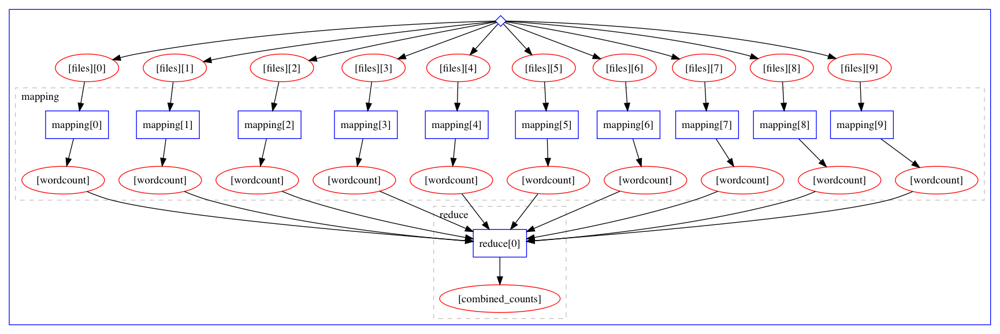
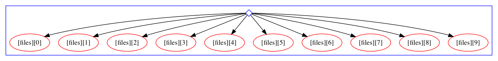
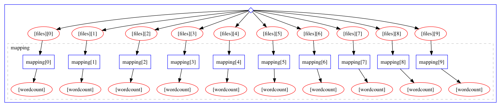

# Map Reduce - Parallel Processing of Data


## Where is this going?

This example will walk you through a simple "Map-Reduce" style workflow in which 
a number of work items are processed in parallel and then a summary job combined
the outputs of the work items into a single output.

The final workflow will look like this:




## Preparation: Making Some Dummy input Data

In this case, we will consider the generation of the input data to *not* be part of the workflow, but rather
assume, that we already have some input files available. Here, we will create a directory and generate ten
text files:

```
mkdir inputdata
for i in $(seq -f "%05g" 1 10);do echo "Hello $i" > inputdata/input_$i.txt;done
```

Voila:

```
ls -lrt inputdata
total 40
-rw-r--r-- 1 lukas staff 12 Dec  3 16:16 input_00001.txt
-rw-r--r-- 1 lukas staff 12 Dec  3 16:16 input_00002.txt
-rw-r--r-- 1 lukas staff 12 Dec  3 16:16 input_00003.txt
-rw-r--r-- 1 lukas staff 12 Dec  3 16:16 input_00004.txt
-rw-r--r-- 1 lukas staff 12 Dec  3 16:16 input_00005.txt
-rw-r--r-- 1 lukas staff 12 Dec  3 16:16 input_00006.txt
-rw-r--r-- 1 lukas staff 12 Dec  3 16:16 input_00007.txt
-rw-r--r-- 1 lukas staff 12 Dec  3 16:16 input_00008.txt
-rw-r--r-- 1 lukas staff 12 Dec  3 16:16 input_00009.txt
-rw-r--r-- 1 lukas staff 12 Dec  3 16:16 input_00010.txt
```

### Counting Words in a File:

For each file we want to count the number of words in it. Therefore we will provide a 
packtivity definition as follows (for convenient we will put the definition under
a file `steps.yml` and identify it with the name `count_words_in_file`):

```
count_words_in_file:
  process:
    process_type: interpolated-script-cmd
    script: |
      wc -w {inputfile} |awk '{{print $1}}' > {outputfile}
  environment:
    environment_type: docker-encapsulated
    image: 'busybox'
  publisher:
    publisher_type: interpolated-pub
    publish:
      wordcount: '{outputfile}'
```

Let's go through the sections

1. ... 
2. ...
3. ...


Let's make sure we got the syntax correct:

```
packtivity-validate 'steps.yml#/count_words_in_file'
packtivity definition is valid
```

#### Testing

We can test this packtivity on a single file like this:

```
packtivity-run 'steps.yml#/count_words_in_file' \
-p inputfile=$PWD/inputdata/input_00010.txt \
-p outputfile="'{workdir}/output.txt'" \
--read inputdata \
--write test_counting
```

```
cat test_counting/output.txt 
2
```

### Write the Workflow (part 1)

First, let's learn how to pass input data to the workflow by starting with an empty workflow:

In a file called: `workflow.yml`, just put a single line:

```
stages: []
```

this is a workflow that does not do anything, but initialize itself. Let's pass in some input data:

```
yadage-run workdir workflow.yml -p files='"*.txt"' -d initdir=$PWD/inputdata --visualize
```




That is, the workflow is initialized such that the special `init` stage has as its "output" the ten
textfiles we just created. To see how to access references to these files from within the workflow
we can use the `yadage-util` command line tool to test a selection 

```
yadage-util testsel workdir/_yadage/yadage_snapshot_workflow.json '{step: init, output: files}'
[
    "/Users/lukas/Code/yadagedev/tutorial/specs/mapreduce/inputdata/input_00001.txt",
    "/Users/lukas/Code/yadagedev/tutorial/specs/mapreduce/inputdata/input_00002.txt",
    "/Users/lukas/Code/yadagedev/tutorial/specs/mapreduce/inputdata/input_00003.txt",
    "/Users/lukas/Code/yadagedev/tutorial/specs/mapreduce/inputdata/input_00004.txt",
    "/Users/lukas/Code/yadagedev/tutorial/specs/mapreduce/inputdata/input_00005.txt",
    "/Users/lukas/Code/yadagedev/tutorial/specs/mapreduce/inputdata/input_00006.txt",
    "/Users/lukas/Code/yadagedev/tutorial/specs/mapreduce/inputdata/input_00007.txt",
    "/Users/lukas/Code/yadagedev/tutorial/specs/mapreduce/inputdata/input_00008.txt",
    "/Users/lukas/Code/yadagedev/tutorial/specs/mapreduce/inputdata/input_00009.txt",
    "/Users/lukas/Code/yadagedev/tutorial/specs/mapreduce/inputdata/input_00010.txt"
]
```

That is, when used within a workflow spec `{step: init, output: files}` will resolve to this array of filenames.


#### Writing the mapping stage:

We will now use the selection expression `{step: init, output: files}` to extend the workflow and schedule 
one processing step for each input file:

```yaml
stages:
- name: mapping
  dependencies: [init]
  scheduler:
    scheduler_type: 'multistep-stage'
    parameters:
      inputfile: {step: init, output: files}
      outputfile: '{workdir}/output.txt'
    scatter:
      method: zip
      parameters: [inputfile]
    step: {$ref: 'steps.yml#/count_words_in_file'}
```


```
rm -rf workdir
yadage-run workdir workflow.yml -p files='"*.txt"' -d initdir=$PWD/inputdata --visualize
```





### Combining Word Counts

We now have the workflow in shape to process all files in parallel. We can now test a
selection to see how to get file references to the outputfiles of these individual
steps:

```
yadage-util testsel workdir/_yadage/yadage_snapshot_workflow.json '{steps: mapping, output: wordcount}'
[
    "/Users/lukas/Code/yadagedev/tutorial/specs/mapreduce/workdir/mapping_0/output.txt",
    "/Users/lukas/Code/yadagedev/tutorial/specs/mapreduce/workdir/mapping_1/output.txt",
    "/Users/lukas/Code/yadagedev/tutorial/specs/mapreduce/workdir/mapping_2/output.txt",
    "/Users/lukas/Code/yadagedev/tutorial/specs/mapreduce/workdir/mapping_3/output.txt",
    "/Users/lukas/Code/yadagedev/tutorial/specs/mapreduce/workdir/mapping_4/output.txt",
    "/Users/lukas/Code/yadagedev/tutorial/specs/mapreduce/workdir/mapping_5/output.txt",
    "/Users/lukas/Code/yadagedev/tutorial/specs/mapreduce/workdir/mapping_6/output.txt",
    "/Users/lukas/Code/yadagedev/tutorial/specs/mapreduce/workdir/mapping_7/output.txt",
    "/Users/lukas/Code/yadagedev/tutorial/specs/mapreduce/workdir/mapping_8/output.txt",
    "/Users/lukas/Code/yadagedev/tutorial/specs/mapreduce/workdir/mapping_9/output.txt"
]
```

#### Writing a Packtivity

Armed with such a list of files, we can now write a new packtivity that will read the
contents of each file (which will be the word counts from their respective input files)
and add them up using the `awk` utility

```
combine_wordcounts:
  process:
    process_type: interpolated-script-cmd
    script: |
      cat {inputfiles} | awk '{{a+=$1}} END {{print a}}'> {outputfile}
  environment:
    environment_type: docker-encapsulated
    image: 'busybox'
  publisher:
    publisher_type: interpolated-pub
    publish:
      combined_counts: '{outputfile}'
```

As always, make sure we at least pass a superficial syntax check:

```
packtivity-validate 'steps.yml#/combine_wordcounts'
packtivity definition is valid
```

To test this packtivity spec, we can use the above input list to generate a input JSON document
for the packtivity which will have the structure 

```
{"inputfiles: [...list of iles...], "outputfile": "{workdir}/output.txt"}
```

To generate this input doc, we will use the `jq` utility

```
yadage-util testsel \
workdir/_yadage/yadage_snapshot_workflow.json '{steps: mapping, output: wordcount}' \
|jq '{inputfiles: ., outputfile: "{workdir}/output.txt"}' > test.json
```

```
cat test.json
{
  "inputfiles": [
    "/Users/lukas/Code/yadagedev/tutorial/specs/mapreduce/workdir/mapping_0/output.txt",
    "/Users/lukas/Code/yadagedev/tutorial/specs/mapreduce/workdir/mapping_1/output.txt",
    "/Users/lukas/Code/yadagedev/tutorial/specs/mapreduce/workdir/mapping_2/output.txt",
    "/Users/lukas/Code/yadagedev/tutorial/specs/mapreduce/workdir/mapping_3/output.txt",
    "/Users/lukas/Code/yadagedev/tutorial/specs/mapreduce/workdir/mapping_4/output.txt",
    "/Users/lukas/Code/yadagedev/tutorial/specs/mapreduce/workdir/mapping_5/output.txt",
    "/Users/lukas/Code/yadagedev/tutorial/specs/mapreduce/workdir/mapping_6/output.txt",
    "/Users/lukas/Code/yadagedev/tutorial/specs/mapreduce/workdir/mapping_7/output.txt",
    "/Users/lukas/Code/yadagedev/tutorial/specs/mapreduce/workdir/mapping_8/output.txt",
    "/Users/lukas/Code/yadagedev/tutorial/specs/mapreduce/workdir/mapping_9/output.txt"
  ],
  "outputfile": "{workdir}/output.txt"
}
```

```
packtivity-run 'steps.yml#/combine_wordcounts' test.json --write test_combination --read workdir
```

Checking the output file, we see that it correctly combined the word count (2 words each in ten files)
```
cat test_combination/output.txt 
20
```

### Writing the Combination Stage

We now add a single step stage to the workflow to do the equivalent thing we just did manually

```
stages:
- name: mapping
  dependencies: [init]
  scheduler:
    scheduler_type: 'multistep-stage'
    parameters:
      inputfile: {step: init, output: files}
      outputfile: '{workdir}/output.txt'
    scatter:
      method: zip
      parameters: [inputfile]
    step: {$ref: 'steps.yml#/count_words_in_file'}

- name: reduce
  dependencies: [mapping]
  scheduler:
    scheduler_type: 'singlestep-stage'
    parameters:
      inputfiles: {steps: mapping, output: wordcount}
      outputfile: '{workdir}/output.txt'

    step: {$ref: 'steps.yml#/combine_wordcounts'}
```

and run again:

```
rm -rf workdir
yadage-run workdir workflow.yml -p files='"*.txt"' -d initdir=$PWD/inputdata --visualize
```

Let's check that the workflow worked out OK:

```

```


